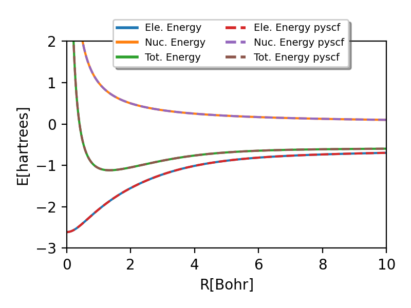

# Restricted Hartree-Fock applet in WASM
The [HF-WASM applet](https://jquinl.github.io/hf-wasm/hf_wasm.html) code 

## TODO

&#9745; Restricted Hartree-Fock single point

&#9745; WASM applet with Raylib

&#9744; Add/remove atoms

&#9744; Geometry optimization

## H2 Dissociation curve

## References
The GUI is made using [Raylib](https://www.raylib.com/)

### RHF algorithm 
<a id="1">[1]</a> [A. Szabo and N. S. Ostlund, Modern Quantum Chemistry: Introduction to Advanced Electronic Structure Theory](https://books.google.es/books?id=6mV9gYzEkgIC) 

### Molecular Orbitals
<a id="2">[2]</a> [T. Helgaker, P. Jorgensen, J. Olsen; Molecular Electronic-Structure Theory](https://doi.org/10.1002/9781119019572)

<a id="3">[3]</a> [K. V. Murphy,  J. M. Turney, H. F. III Schaefer; Student-Friendly Guide to Molecular Integrals;J. Chem. Ed. 2018;95 (9); 1572-1578;](https://doi.org/10.1021/acs.jchemed.8b00255)

### Special functions/Eigenvalues/Eigenvectors

<a id="4">[4]</a>[W. H. Press, S. A. Teukolsky, W. T. Vetterling, B. P. Flannery; Numerical recipes in C (2nd ed.): the art of scientific computing](https://doi.org/10.5555/148286)

<a id="5">[5]</a>[J. H. Wilkinson. (1962-1963). Householder's method for symmetric matrices. , 4(1), 354–361.](https://doi.org/10.1007/bf01386332)

<a id="6">[6]</a> [H. Bowdler; R. S. Martin; C. Reinsch; J. H. Wilkinson. (1968). TheQRandQLalgorithms for symmetric matrices. , 11(4), 293–306.](https://doi.org/10.1007/bf02166681)

### Tests
###### RHF tested against values generated with 
<a id="6">[4]</a> [Q. Sun, X. Zhang, S. Banerjee, P. Bao, M. Barbry, N. S. Blunt, N. A. Bogdanov, G. H. Booth, J. Chen, Zhi-Hao Cui, J. J. Eriksen, Y. Gao, S. Guo, J. Hermann, M. R. Hermes, K. Koh, P. Koval, S. Lehtola, Z. Li, J. Liu, N. Mardirossian, J. D. McClain, M. Motta, B. Mussard, H. Q. Pham, A. Pulkin, W. Purwanto, P. J. Robinson, E. Ronca, E. R. Sayfutyarova, M. Scheurer, H. F. Schurkus, J. E. T. Smith, C. Sun, Shi-Ning Sun, S. Upadhyay, L. K. Wagner, X. Wang, A. White, J. Daniel Whitfield, M. J. Williamson, S. Wouters, J. Yang, J. M. Yu, T. Zhu, T. C. Berkelbach, S. Sharma, A. Yu. Sokolov, G. Kin-Lic Chan; Recent developments in the PySCF program package. J. Chem. Phys. 2020; 153 (2): 024109. ](https://doi.org/10.1103/PhysRevB.105.245404)

###### Molecular orbitals tested against values generated with 
<a id="7">[53]</a> [K. V. Murphy,  J. M. Turney, H. F. III Schaefer; Student-Friendly Guide to Molecular Integrals; J. Chem. Ed. 2018;95 (9); 1572-1578;](https://doi.org/10.1021/acs.jchemed.8b00255) (5th handout)

